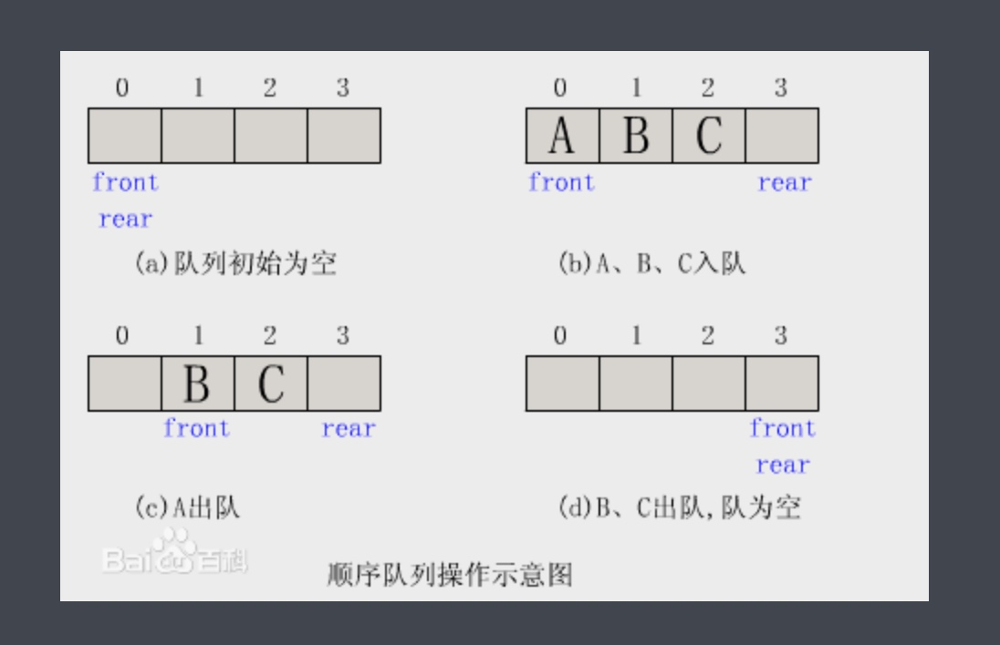

# 数据结构与算法-队列

> 文章出自：[安卓进阶学习指南](https://github.com/iwannabetop/Awesome-Android-Learning-Guide)

跟着大佬学**队列**：
1. [金鑫](https://github.com/iwannabetop/Awesome-Android-Learning-Guide/blob/master/datastruct/queue/%E9%98%9F%E5%88%97-%E9%87%91%E9%91%AB.md)
2. [shixinzhang](http://e2675cd5.wiz03.com/share/s/3ypRPl26JkPC2ZVPUZ15n5wo06yvzD0HR4Bn2qIFd317E-tY)
3. [放肆得微笑](https://github.com/iwannabetop/Awesome-Android-Learning-Guide/blob/master/datastruct/queue/%E9%98%9F%E5%88%97-%E6%94%BE%E8%82%86%E5%BE%97%E5%BE%AE%E7%AC%91.md)
4. [Alex-zhao](https://github.com/iwannabetop/Awesome-Android-Learning-Guide/blob/master/datastruct/queue/%E9%98%9F%E5%88%97-Alex-zhao.md)
5. [Struggle](https://github.com/iwannabetop/Awesome-Android-Learning-Guide/blob/master/datastruct/queue/%E9%98%9F%E5%88%97-Struggle.md)
6. [ZHL](https://github.com/iwannabetop/Awesome-Android-Learning-Guide/blob/master/datastruct/queue/%E9%98%9F%E5%88%97-ZHL.md)
7. [Cloud](https://github.com/iwannabetop/Awesome-Android-Learning-Guide/blob/master/datastruct/queue/%E9%98%9F%E5%88%97%EF%BC%88%E4%BD%BF%E7%94%A8%E5%9C%BA%E6%99%AF%E5%8F%8A%202%20%E4%B8%AA%E9%98%9F%E5%88%97%E5%AE%9E%E7%8E%B0%E6%A0%88%EF%BC%89_Cloud.md)
8. [麦田哥](https://note.youdao.com/share/?id=62d3a5a8aca157e2d176eac549babf06&type=note#/)
9. [Anonymous](https://github.com/iwannabetop/Awesome-Android-Learning-Guide/blob/master/datastruct/queue/%E9%98%9F%E5%88%97-Anonymous.md)


>02/05/2018
😀 五一想给自己放个假所以延期了。

## 基本概念
**队列**是一种特殊的线性表，遵循先进先出（FIFO）的原则。只允许从队尾插入，队头删除。有数组和链表两种方式实现队列。

## 队列的分类
### 1）顺序队列

建立顺序队列必须为其创建静态分配或动态申请一片连续的空间，并设置两个指针。front指向队头元素位置，rear指向即将插入的元素位置即队尾。


从上图分析，当A、B、C都出列时，如果这时有一个D想入列，就会出现溢出现象（假溢出），因为随着A、B、C的出列它们对应的存储单元依旧被它们占用。所以如果想继续添加元素，只能循环使用队列中的存储单元，这时循环队列就相应出现了。

### 2）循环队列
将队列空间形成环形空间，环形空间的存储单元循环使用，用这种方法管理的队列叫做循环队列。


如图所示：
当front和rear指向同一个位置时，表示队列为空；
当rear的下一个指针为front时，表示队列已满。


## 队列的应用
* 作用：
    缓冲、 解耦
    
* 场景：
    1）MessageQueue消息队列。
    2）生产者与消费者模式。一个队列负责生产，一个队列负责消费。他们之间没有关联，互不干扰。


### 两个队列实现栈：

```
/**
 * Created by milo on 2018/4/26.
 * 两个队列实现一个栈
 * 思路：在一个队列添加删除，另外一个队列中转
 * 栈   先进后出，
 * 队列 先进先出
 */
public class MiloQueue {
    private ArrayBlockingQueue<Integer> mQueue1, mQueue2;
    private int size;

    public MiloQueue(ArrayBlockingQueue<Integer> queue1, ArrayBlockingQueue<Integer> queue2, int size) {
        mQueue1 = queue1;
        mQueue2 = queue2;
        this.size = size;
    }

    /**
     * 入栈
     *
     * @param a
     */
    public void add(int a) {
        //检查是否越界
        if (checkMax()) {
            return;
        }
        if (mQueue1.size() > 0) {
            //判断mQueue1 是否为空队列，不是则向mQueue1添加元素，否则向mQueue2添加元素
            mQueue1.add(a);
        } else {
            mQueue2.add(a);
        }

    }

    /**
     * 出栈
     *
     * @return
     */
    public int remove() {
        int remove = -1;
        //为空判断
        if (isEmpty()) {
            return remove;
        }
        if (mQueue1.size() > 0) {
            //mQueue1 不为空即元素都在mQueue1中，此时需要将mQueue1中的元素除最后一个元素以外都转移到mQueue2中，然后删除mQueue1的最后一个元素
            while (mQueue1.size() > 1) {
                mQueue2.add(mQueue1.remove());
            }
            remove = mQueue1.remove();
        } else {
            //反之 mQueue2中的元素，除了最后一个也转移至mQueue1中,然后删除mQueue2中的最后一个元素
            while (mQueue2.size() > 1) {
                mQueue1.add(mQueue2.remove());
            }
            remove = mQueue2.remove();
        }
        return remove;
    }

    /**
     * 遍历
     *
     * @return
     */
    public String toString() {
        StringBuffer result = new StringBuffer();
        if (mQueue1.size() > 0) {
            Object[] array = mQueue1.toArray();
            for (Object o : array) {
                result.append(o + " ");
            }
            return result.toString();
        } else {
            Object[] array = mQueue2.toArray();
            for (Object o : array) {
                result.append(o + " ");
            }
            return result.toString();
        }
    }

    /**
     * 检查是否为空队列
     *
     * @return
     */
    private boolean isEmpty() {
        return (mQueue1.size() + mQueue2.size()) == 0;
    }


    /**
     * 检查队列是否已满
     *
     * @return
     */
    private boolean checkMax() {
        return mQueue1.size() + mQueue2.size() > size;
    }


    public static void main(String[] args) {
        ArrayBlockingQueue queue1 = new ArrayBlockingQueue(5);
        ArrayBlockingQueue queue2 = new ArrayBlockingQueue(5);

        MiloQueue miloQueue = new MiloQueue(queue1, queue2, 10);
        miloQueue.add(1);
        miloQueue.toString();
        System.out.println("add 1: " + miloQueue.toString());

        miloQueue.add(2);
        System.out.println("add 2: " + miloQueue.toString());

        miloQueue.remove();
        System.out.println("remove: " + miloQueue.toString());

        miloQueue.add(3);
        System.out.println("add 3: " + miloQueue.toString());
    }
}
```
运行结果：


## 注意
* 在循环队列中,当队列为空时有front = rear。当队列空间全占满时也有front = rear。为了区别这种情况，规定循环队列中只能存放MaxSize - 1个队列元素。即当能该队列中只存在一个空存储单元时，表明该队列已满。  

## 队列与栈的区别
* 相同点：
都是抽象概念，都可以通过数组、链表实现。
* 不同点：
主要体现在取数据的时候，栈是先入后出（FILO），队列是先入先出（FIFO）。

# 参考
https://baike.baidu.com/item/%E9%98%9F%E5%88%97/14580481?fr=aladdin


